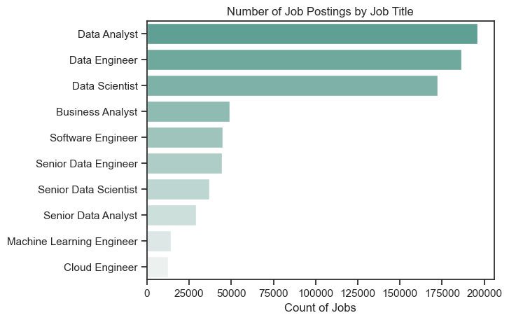
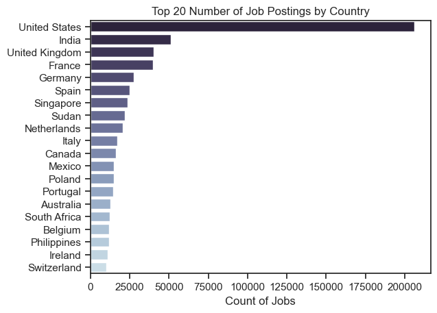
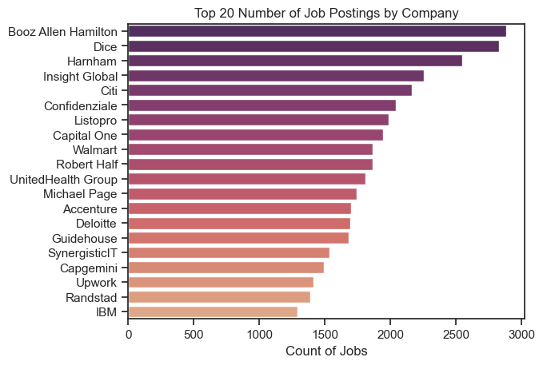
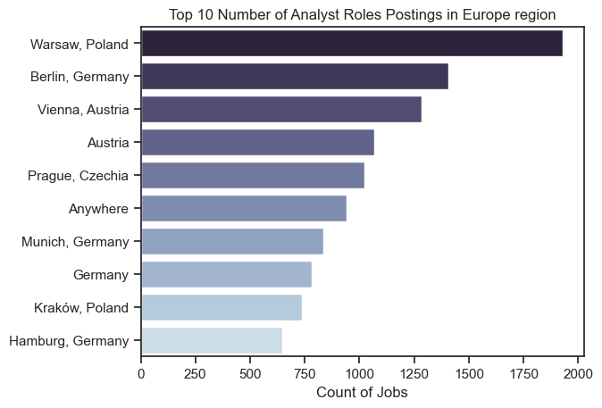
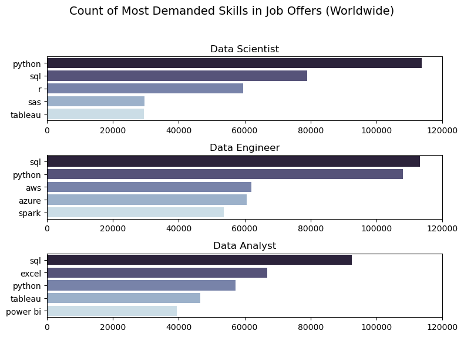
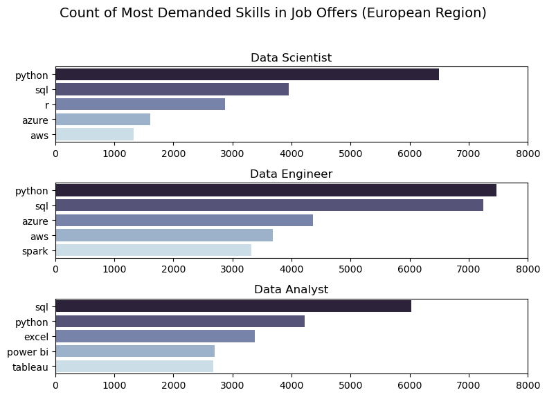
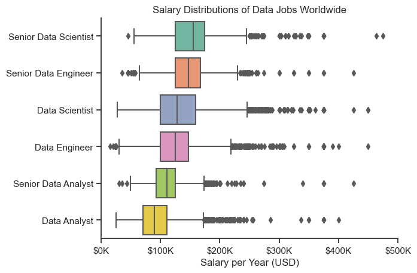
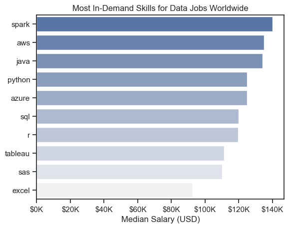

# Introduction
**📊 Discover Opportunities in the Data Job Market!**
 This project provides an in-depth analysis of high-paying positions for **Data Analysts** 💼, but also for **Data Engineers** 🛠️, **Data Scientist** 🔬 and much more. It highlights the most demanded skills and identifies areas where **high demand** 📈  coincides with **lucrative salaries**  💰 in the data jobs field. By examining market trends, skill requirements, and salary data, this project aims to guide data enthusiast toward the most promising career opportunities. Whether you are looking to upskill or transition into the field, this comprehensive overview will help you understand where to focus your efforts for maximum career growth and financial reward. Partly similar to my [Data Jobs Project](https://github.com/igorwintner/sql_data_jobs_project) crafted in SQL, but this project goes more in depth. There are explanations for each code so that even a person who has no programming experience knows what the code means. Only the parts of the code where visualizations are created are always included to make the project coherent and easier to read. However, links to the full Jupyter Notebook are provided below each section, showing the entire creation process from the beginning to the final visualization. There are also notes for better understanding the code. 
 ## Goals
1. Explore the highest-paying positions and sought-after skills within the field of data science.
2. Utilize Python to analyze a dataset of real job postings for 2023.
3. For job seekers: leverage these findings to identify optimal career opportunities.
# Questions to Answer
**1. What are the primary skills required for the Top 3 most popular data roles?**

**2. How are the trending skills evolving for Analysts Roles?**

**3. What is the earning potential for Data Roles based on their skills?**

**4. Which skill offers the best combination of high demand and high pay for Data Analysts, Data Engineers and Data Scientists?**
# Tech Stack
- **Python:** The foundation of my analysis, enabling me to process data and uncover critical insights. I utilized several Python libraries and tools to enhance my workflow:

    - **Pandas Library:** 🐼 This library was essential for data manipulation and analysis. It allowed me to organize, clean, and analyze datasets efficiently.

    - **Matplotlib Library:** 🖌️ I used Matplotlib to create a variety of data visualizations, such as charts and graphs, to represent findings effectively.

    - **Seaborn Library:** 🌟 This library helped me to generate advanced and aesthetically pleasing visuals. It built on Matplotlib to offer more sophisticated plotting options and statistical graphics.

- **Jupyter Notebooks:** 📝 I employed Jupyter Notebooks to write and execute Python code, allowing me to document my process, include explanations, and present my findings interactively.

- **VS Code:** 💻 My preferred IDE for writing and running Python scripts. It provided a robust environment for coding with helpful features for development and debugging.

- **Git & GitHub:** 🌐 Ability to share the project with others, but also easily manageable versions of the code.
# Data Preparation and Cleanup  🔧🧹
 ```python
 # Import Libraries

import pandas as pd
import matplotlib.pyplot as plt
import seaborn as sns
import ast

# Loading Data

df = pd.read_parquet('path/to/the/file/data_jobs.parquet')

# A bit of cleaning up

df['job_posted_date'] = pd.to_datetime(df['job_posted_date']) # Convert to a datetime datatype
df['job_skills'] = df['job_skills'].apply(lambda x: ast.literal_eval(x) if pd.notna(x) else x) # Convert from 'str' to a list
df.sort_values(by='job_posted_date', inplace=True) # Sort the data by the date the job was added
```
# Initial Data Inspecting
## Roles to Discover
```python
# Count occurrences of each job title
df_plot = df['job_title_short'].value_counts().reset_index()
df_plot.columns = ['job_title_short', 'count']  # Rename columns after resetting index

# Plot using Seaborn barplot
sns.barplot(data=df_plot, x='count', y='job_title_short', palette='light:#5A9_r')

# Add labels and show plot
plt.xlabel('Count of Jobs')
plt.ylabel('')
plt.title('Number of Job Postings by Job Title')
plt.show()
```
 

*Bar chart visualising the count of data job offers (Worldwide)*

This bar chart shows the count of job postings for various job titles in the data field. The titles include:

1.  Data Analyst: Approximately 190,000 job postings
2. Data Engineer: Approximately 180,000 job postings
3. Data Scientist: Approximately 160,000 job postings
4. Business Analyst: Approximately 90,000 job postings
5. Software Engineer: Approximately 70,000 job postings
6. Senior Data Engineer, Senior Data Scientist, Senior Data Analyst: Each around 30,000 job postings
7. Machine Learning Engineer, Cloud Engineer: Each less than 10,000 job postings

**Key Insights:**
- **Data Analyst**, **Data Engineer**, and **Data Scientist** roles dominate the job market, collectively accounting for over **500,000** job postings.
- There is a significant drop in the number of postings for senior positions and specialized roles such as Machine Learning Engineer and Cloud Engineer.
## Countries to Discover
```python
# Count occurrences of job offers by country (Top 20)
df_plot = df['job_country'].value_counts().to_frame().head(20).reset_index()
df_plot.columns = ['job_country', 'count']  # Rename columns after resetting index

# Plot using Seaborn barplot
sns.barplot(data=df_plot, x='count', y='job_country', palette='ch:s=.25,rot=-.25_r')

# Add labels and show plot
plt.xlabel('Count of Jobs')
plt.ylabel('')
plt.title('Top 20 Number of Job Postings by Country')
plt.show()
```
 

*Bar chart visualising the count of data job offers by country*

This bar chart shows the Top 20 countries with the highest count of job postings in the data field. The countries include:

- United States: Over 200,000 job postings
- India: Approximately 70,000 job postings
- United Kingdom: Approximately 30,000 job postings
- France, Germany: Each around 25,000 job postings
- Spain, Singapore, Sudan: Each around 20,000 job postings
- Netherlands, Italy, Canada, Mexico, Poland, Portugal: Each around 15,000 job postings
- Australia, South Africa, Belgium, Philippines, Ireland, Switzerland: Each around 10,000 job postings

**Key Insights:**

- **The United States** has a dominant lead with over **200,000** job postings, more than triple that of India, which is second.
- Significant opportunities exist in **Europe** and **Asia**, with countries like the UK, France, Germany, Spain, and Singapore having a considerable number of job postings.
- There is a diverse global demand for data-related jobs, spanning multiple continents and regions.
## Companies to Discover
```python
# Count occurrences of job offers by company (Top 20)
df_plot = df['company_name'].value_counts().to_frame()[1:].head(20).reset_index() # It was necessary to skip the first company because it was probably a mistake
df_plot.columns = ['company_name', 'count']  # Rename columns after resetting index

# Create a bar plot with Seaborn
sns.barplot(data=df_plot, x='count', y='company_name', palette='flare_r')

# Set the labels and title
plt.xlabel('Count of Jobs')
plt.ylabel('')
plt.title('Top 20 Number of Job Postings by Company')
plt.show()
```


*Bar chart visualising the Top 20 companies with the most data job offers (Worldwide)*

This bar chart shows the Top 20 companies with the highest count of job postings in the data field. The companies include:

- Booz Allen Hamilton: Approximately 3,000 job postings
- Dice, Harnham, Insight Global: Each around 2,500 job postings
- Citi, Confidenziale, Listopro: Each around 2,000 job postings
- Capital One, Walmart, Robert Half: Each around 1,800 job postings
- UnitedHealth Group, Michael Page, Accenture, Deloitte: Each around 1,500 job postings
- Guidehouse, SynergisticIT, Capgemini, Upwork, Randstad, IBM: Each around 1,200 to 1,000 job postings

**Key Insights:**

- Booz Allen Hamilton leads with the highest number of job postings.
- A mix of consultancy firms, tech companies, and staffing agencies are among the top employers.
- The distribution among the top companies is relatively even, with all listed companies having over 1,000 job postings.

I also wanted to explore the European market, which may be more specific in some ways. The main regions of Central Europe were chosen. These countries are Germany, Austria, Poland, the Czech Republic and Slovakia. The data above shows that Germany and Poland in particular, as Central European metropolis, are countries where a relatively high number of Data Jobs are in demand (Germany 5th worldwide and Poland 13th worldwide). It only includes analyst roles, i.e. Data Analyst, Senior Data Analyst and Business Analyst.

```python
# Count occurrences of job offers by location in the central Europe region (Top 10)
df_plot = df_eur_jobs['job_location'].value_counts().head(10).to_frame().reset_index()
df_plot.columns = ['job_location', 'count']  # Rename columns after resetting index

# Plot using Seaborn barplot
sns.barplot(data=df_plot, x='count', y='job_location', palette='ch:s=.25,rot=-.25_r')

# Add labels and show plot
plt.xlabel('Count of Jobs')
plt.ylabel('')
plt.title('Top 10 Number of Analyst Roles Postings in Europe region')
plt.show()
```



*Bar chart visualising the Top 10 count of Analyst job offers by city in Central Europe*

This bar chart illustrates the count of job postings for analyst roles in various European cities and regions. The locations include:

- Warsaw, Poland: Approximately 1,800 job postings
- Berlin, Germany: Approximately 1,400 job postings
- Vienna, Austria: Approximately 1,200 job postings
- Austria (unspecified location): Approximately 1,100 job postings
- Prague, Czechia: Approximately 1,000 job postings
- Anywhere (remote or flexible location): Approximately 900 job postings
- Munich, Germany: Approximately 850 job postings
- Germany (unspecified location): Approximately 800 job postings
- Kraków, Poland: Approximately 750 job postings
- Hamburg, Germany: Approximately 700 job postings

**Key Insights:**

- **Warsaw, Poland** leads the European region with the highest number of analyst job postings, indicating a strong demand for analysts in this city.
- **Berlin, Germany**, and **Vienna, Austria** follow with significant numbers of postings, suggesting that these cities are also major hubs for analyst roles.
- There is notable demand across multiple locations in Germany, with Berlin, Munich, and Hamburg all featuring in The Top 10, alongside unspecified locations in Germany.
- The inclusion of "Anywhere" in the Top 10 suggests a growing acceptance and demand for remote or flexible working arrangements for analyst roles.
- The diversity of locations, including cities in Poland, Austria, Czechia, and Germany, highlights a widespread need for analysts across different parts of Europe.

### More EDA can be found in the 1st Jupyter notebook via this 🔗[Link](1_EDA_Intro.ipynb)

# The Analysis
## 1. What are the primary skills required for the Top 3 most popular data roles?
```python
# Define the job titles to plot
job_titles = ['Data Scientist', 'Data Engineer', 'Data Analyst']

# Create a figure with 3 subplots arranged vertically, adjusting the figure size
fig, ax = plt.subplots(3, 1, figsize=(8, 6))

# Loop through each job title to create a subplot
for i, job_title in enumerate(job_titles):
    # Filter the data for the current job title and select the top 5 skills
    df_plot_ww = df_skills_count_ww[df_skills_count_ww['job_title_short'] == job_title].head(5)
    
    # Plot a horizontal bar chart for the current job title
    sns.barplot(data=df_plot_ww, x='skill_count', y='job_skills', ax=ax[i], palette='ch:s=.25,rot=-.25_r')
    ax[i].set_title(job_title)
    
    # Customize the subplot: remove x-axis and y-axis label and set x-axis limit
    ax[i].set_xlabel('')
    ax[i].set_ylabel('')
    ax[i].set_xlim(0, 120000)

fig.suptitle('Count of Most Demanded Skills in Job Offers (Worldwide)', fontsize=14)
fig.tight_layout(rect=[0, 0.03, 1, 0.95])
plt.show()
# This is code for only the first chart
```


*Bar chart visualising the most demanded skills for the Top 3 most popular data roles (Worldwide)*


### Compare worldwide results with results in Central Europe


*Bar chart visualising the most demanded skills for the Top 3 most popular data roles (Cent. European reg.)*


As we can see from the charts, the Top 3 most common data positions, i.e. **Data Scientist**, **Data Engineer** and **Data Analyst**, the first 5 most in-demand skills are very similar worldwide and in Central Europe. In particular, **SQL** and **Python** are dominant for all three positions. Most of the skills are then already in very similar demand and the difference is at most in the ranking, i.e. in the number of jobs that require the skill. The difference is in the Data Scientist role offers, where **SAS** and **Tableau** are in demand worldwide, while cloud solutions such as **Azure** or **AWS** are more in demand in the Central Europe region.

**Key Insights:**

- **SQL** and **Python** are essential for all Data Roles! Those are the ones to build on. Other tech stack may vary, but **Cloud** solutions are another very important part of the data stack.

### Full code can be found in 2nd Jupyter Notebook via this 🔗[Link](2_Demanded_Skills.ipynb).

## 2. How are the trending skills evolving for Analysts Roles?
### Only Data Analysts in Central Europe region
In this case I only wanted Data Analyst roles in the Central Europe region, i.e. the countries of Germany, Austria, Czech Republic, Poland and Slovakia. This is the most common role, so only that is included. For the Senior Data Analyst, the Top 5 skills would most likely be exactly the same and only more experience with the technology would be required or additional technologies (e.g. Cloud-based) would be required. However, these would not be in the Top 5. For a Business Analyst, the difference would likely be mostly in the level of knowledge of the technology required, but the Top 5 skills would be the same or nearly the same. 
```python
# Select Top 5 Skills of the DataFrame for plotting
df_plot = df_eur_jobs_perc.iloc[:, :5]

# Create a line plot with Seaborn
sns.lineplot(data=df_plot, dashes=False, palette='pastel')
sns.set_theme(style='ticks')
sns.despine()

# Set the labels and title
plt.title('Trending Top 5 Skills for Data Analysts (Cent. Europe Reg.)')
plt.xlabel('2023')
plt.ylabel('Likelihood in Job Posting')
plt.legend().remove()

# Format the y-axis to display percentages with no decimal places
from matplotlib.ticker import PercentFormatter
ax = plt.gca()
ax.yaxis.set_major_formatter(PercentFormatter(decimals=0))

# Annotate the plot with the skill names at the end of the lines
for i in range(5):
    # Get the y-position of the last value for each line
    y_position = df_plot.iloc[-1, i]
    
    # Adjust the position of the text for better readability (fourth and fifth skills overlapped)
    if i == 3:  
        y_position += 0.3
    elif i == 4:
        y_position += -1 
    
    # Add the skill name as text on the plot
    plt.text(11.2, y_position, df_plot.columns[i])

plt.show()
```


*Line chart visualising Top 5 trending skills for Data Analyst roles*

This line chart visualizes the monthly percentage of job postings in 2023 that mention each of the Top 5 skills for Data Analysts in Central Europe region. The y-axis represents the likelihood of a skill appearing in job postings, while the x-axis shows the months of the year. The trend also shows that if there was interest in a given skill at a given time, in most cases there was also interest in a different skill, but to a different degree.

**Key Insights:**

- **SQL** is the most demanded skill, consistently appearing in over 40% of job postings. Compared to Python, it seems to be trending more downwards. 
- **Python** also shows high demand, with a steady presence around 30%.
- **Excel** maintains moderate demand, fluctuating between 20-25%.
- **Power BI** and **Tableau** have similar demand patterns, each maintaining around 20% likelihood, with some fluctuations throughout the year.


### Full code can be found in 3rd Jupyter Notebook via this 🔗[Link](3_Skills_Trend.ipynb).

## 3. What is the earning potential for Data Roles based on their skills?
The dataset contains too few job offers in the Central European region that also include salaries, so the results would be biased. Therefore, job offers data from all over the world are now used to make the graph more representative. It would be more typical to use Top 5 instead of Top 6, but in that case the chart would not include the Data Analyst role, which is the number one role in terms of job postings. Therefore, the Top 6 data positions with annual salary in USD are displayed.
```python
# Create a box plot with Seaborn
sns.boxplot(data=top6_jobs, x='salary_year_avg', y='job_title_short', order=job_order, palette='Set2')
sns.set_theme(style='ticks')
sns.despine()

# Set the labels and title
plt.title('Salary Distributions of Data Jobs Worldwide')
plt.xlabel('Salary per Year (USD)')
plt.ylabel('')
plt.xlim(0, 500000) # Set the limit for the x-axis 500K

# Format the x-axis ticks to display salaries in thousands (e.g., 50K, 100K)
ticks_x = plt.FuncFormatter(lambda y, pos: f'${int(y/1000)}K')
plt.gca().xaxis.set_major_formatter(ticks_x)

plt.show()
```


*Box plot visualizing the salary distributions for the Top 6 data jobs (Worldwide)*

This box plot illustrates the salary distributions for various data job titles across the globe. The X-axis shows the salary per year in USD, and the Y-axis lists job titles such as Senior Data Scientist, Senior Data Engineer, Data Scientist, Data Engineer, Senior Data Analyst, and Data Analyst. Each box plot represents the range of salaries for a specific job title, including the median salary, interquartile range, and any outliers. This visualization provides an overview of how salaries vary within and across different job titles in the data field.

**Key Insights:**

**1. Highly Paid Positions:**

- Roles such as Senior Data Scientist and Senior Data Engineer have the highest median salaries and exhibit a wide range of salary distributions, highlighting the variation in pay based on experience and location.

**2. Mid-Level Paid Positions:**

- Data Scientist and Data Engineer roles, though offering lower median salaries than their senior counterparts, still show substantial salary ranges, indicating strong demand and growth potential in these positions.

**3. Lower-Level Paid Positions:**

- Senior Data Analyst and Data Analyst roles have the lowest median salaries and narrower salary distributions, suggesting more standardized pay scales and potentially fewer variations in required skill levels.


**Salary Ranges and Outliers:**

- Significant outliers in salary distributions, especially at the higher end, suggest that top performers or those in high-demand regions can earn significantly more than the median, indicating lucrative opportunities for the best in the field. This can be applied to all the Top 6 Data Jobs.

### I also wanted to include the Top 10 most in-demand skills for all the Data Jobs with median salary.
These are the most in-demand skills across all data roles, but the list is ranked by median salary, not by 'popularity', i.e. by count of job offers. In this case, SQL would be first, Python second and R a close and perhaps slightly surprising third. This can be seen in more detail in the Jupyter Notebook.
```python
df_skills = df_skills.reset_index()

# Create a bar plot with Seaborn
sns.barplot(data=df_skills, x='median', y='job_skills', palette='light:b_r')
sns.set_theme(style='ticks')

# Set the labels and title
plt.title('Most In-Demand Skills for Data Jobs Worldwide')
plt.ylabel('')
plt.xlabel('Median Salary (USD)')

# Format the x-axis ticks to display salaries in thousands (e.g., 50K, 100K)
ticks_x = plt.FuncFormatter(lambda y, pos: f'${int(y/1000)}K')
plt.gca().xaxis.set_major_formatter(ticks_x)

plt.show()
```


*Bar chart visualizing the Top 10 most demanded skills for data jobs with median salary (Worldwide)*


This bar chart displays the median salaries for the top ten most in-demand skills in data jobs worldwide. The X-axis represents the median salary in USD, while the Y-axis lists the skills, including Spark, AWS, Java, Python, Azure, SQL, R, Tableau, SAS, and Excel. The chart highlights which skills are associated with higher median salaries, indicating their relative demand and value in the job market.

**Key Insights:**

**1. Highest Paying Skills:**
 - Skills like **Spark, AWS,** and **Java** are at the top of the salary scale, indicating their high demand and significant value in the data job market. While these are popular technologies, they are also highly specialized and not entirely suitable for beginners. 

**2. Middle Tier Paying Skills:** 
- **Python, Azure, SQL**, and **R** also offer high median salaries, reflecting their widespread use and essential role in data-related positions.

**3. Lower Paying Skills:** 
- Skills such as **Tableau, SAS,** and **Excel**, while valuable, are associated with lower median salaries, suggesting they might be more common or less specialized compared to other skills on the list.

### Full code can be found in 4th Jupyter Notebook via this 🔗[Link](4_Salary_Analysis.ipynb).

## 4. Which skill offers the best combination of high demand and high pay for Data Analysts, Data Engineers and Data Scientists?

It is important to note that the number of skills varies from chart to chart, as the percentages of individual job offer that requires a skill vary for Data Analysts, Data Engineers and Data Scietists, as can be seen in the resulting tables above. For Data Analysts, the percentage threshold was set at 5%, which yielded the 14 most in-demand skills. However, for Data Engineers, the percentage is as high as 15%, as the percentage of demand for this skill also varies. In comparison, for Data Analysts, SQL is in demand 56.5% of the time. However, for Data Engineers it is almost 71%. If the percentages were also set to at least 5% to include the skill in the chart, the chart would be very unclear. The chart includes Data Engineers with the 13 most in-demand skills and Data Scientist the 11 most in-demand skills. The percentage threshold for Data Scientist to include a skill in the chart is set at 10%.
```python
from adjustText import adjust_text

dfs = [df_DA_skills_high_demanded, df_DE_skills_high_demanded, df_DS_skills_high_demanded]
titles = ['Most Optimal Skills for Data Analysts', 'Most Optimal Skills for Data Engineers', 'Most Optimal Skills for Data Scientists']

colors = sns.color_palette('Set1', max(len(df) for df in dfs))

# Create a figure with 3 subplots in a single column
fig, axs = plt.subplots(3, 1, figsize=(8, 10))

# Loop over each DataFrame and corresponding axis
for ax, df, title in zip(axs, dfs, titles):
    # Create a scatter with custom colors
    for i, (x, y) in enumerate(zip(df['skill_percent'], df['median_salary'])):
        ax.scatter(x, y, color=colors[i])
    
    # Set the labels and title
    ax.set_title(title)
    ax.set_xlabel('Percent of Data Jobs')
    ax.set_ylabel('Median Salary ($USD)')
    
    # Format the y-axis to show salaries in thousands
    ax.yaxis.set_major_formatter(plt.FuncFormatter(lambda y, pos: f'${int(y/1000)}K'))
    
    # Create text annotations with corresponding colors
    texts = []
    for i, txt in enumerate(df.index):
        x = df['skill_percent'].iloc[i]
        y = df['median_salary'].iloc[i]
        texts.append(ax.text(x, y, " " + txt, fontsize=9, color=colors[i]))
    
    # Adjust text to avoid overlap and add arrows
    adjust_text(texts, ax=ax, arrowprops=dict(arrowstyle='->', color='gray'), 
                only_move={'points':'y', 'texts':'y'}, force_text=0.75, force_points=0.15)

plt.tight_layout()
plt.show()
```


*Scatter plot visualizing the most optimal skills for Top 3 data roles with median salary (Worldwide)*

This composite chart features 3 scatter plots that highlight the most optimal skills for Top 3 Data Roles—Data Analysts, Data Engineers, and Data Scientists—based on median salary and the percentage of data jobs requiring these skills.

**Chart 1: Most Optimal Skills for Data Analysts** 

This scatter plot reveals the most valuable skills for Data Analysts, with the X-axis showing the percentage of data jobs that list each skill and the Y-axis indicating the median salary (USD) associated with those skills. Highlighted skills include AWS, Azure, Python, SQL, and Excel, showcasing their importance and value in the Data Analyst role.

**Chart 2: Most Optimal Skills for Data Engineers** 

This scatter plot depicts the most sought-after skills for Data Engineers. The X-axis represents the percentage of data jobs requiring each skill, while the Y-axis displays the median salary (USD) for those skills. Key skills such as Python, SQL, AWS, Spark, and Azure are featured, underscoring their critical role and high salary potential in the Data Engineering field.

**Chart 3: Most Optimal Skills for Data Scientists** 

This scatter plot demonstrates the most essential skills for Data Scientists, with the X-axis showing the percentage of data jobs that demand each skill and the Y-axis representing the median salary (USD) for those skills. Notable skills like Python, SQL, Spark, AWS, and TensorFlow are highlighted, emphasizing their significance and high salary prospects in the Data Scientist role.

Together, these charts provide a comprehensive overview of the key skills needed for the Top 3 data roles, as well as the financial rewards associated with these skills in the job market.

**Key Insights:**

**High-Value Skills Across Roles:**

Skills like **Python, SQL**, and **AWS** consistently appear across all three roles (Data Analysts, Data Engineers, and Data Scientists), indicating their broad applicability and high demand in the data job market.

**Role-Specific High-Paying Skills:**

For **Data Analysts**, skills like **AWS** and **Azure** command high median salaries.
For **Data Engineers**, skills such as **Kafka, Scala**, and **Airflow** are associated with higher salaries.
For **Data Scientists**, **TensorFlow** and **Spark** are among the top-paying skills, reflecting their specialized nature.

**Common Skills with Wide Usage:**

Skills like **SQL** and **Python** not only have high salary potential but are also required in a large percentage of data jobs, making them essential for professionals aiming to enter or advance in the data field.

**Specialized Skills for Engineers and Scientists:**

**Data Engineers** benefit from specialized skills like **Kafka, Scala**, and **Redshift**, which are linked to higher salaries and more technical roles.
**Data Scientists** see high returns from expertise in **TensorFlow** and **Spark**, indicating the importance of machine learning and big data processing skills in this role.

**Variation in Skill Importance by Role:**

While some skills are valuable across multiple roles, their importance and salary impact can vary significantly. For instance, **Tableau** is highly valued for **Data Analysts** but less critical for **Data Engineers**.

**Optimal Skill Combinations:**

The combination of **high-demand** and **high-salary** skills like **Python, SQL**, and **AWS** can significantly boost career prospects and earning potential across all data-related roles.


### Full code can be found in 5th Jupyter Notebook via this 🔗[Link](5_Optimal_Skills.ipynb).

# Insights 🔍 
**Dominance in Job Market:**

- **Data Analyst, Data Engineer**, and **Data Scientist** roles dominate the job market, with over **500,000** job postings collectively.

**Skill Demand and Trends:**

- **SQL** and **Python:** Essential across all data roles. Cloud-based solutions are also quite prevalent. For Data Analysts SQL appears in over 40% of job postings but is trending a bit downward, while Python maintains a steady demand around 30%.
Excel: Moderately demanded, fluctuating between 20-25%.
Power BI and Tableau: Each holds around 20% demand with some fluctuations.

**Salary Insights:**

- Highest Paid Positions: Senior Data Scientist and Senior Data Engineer roles command the highest median salaries, with significant variation based on experience and location.
- Mid-Level Positions: Data Scientist and Data Engineer roles offer substantial salary ranges, indicating strong demand and growth potential.
- Lower-Level Positions: Senior Data Analyst and Data Analyst roles have lower median salaries and more standardized pay scales.

**Salary Outliers:**

- Top performers or those in high-demand regions can earn significantly more than the median, indicating lucrative opportunities for the best in the field.

**Skill-Specific Salaries:**

- Highest Paying Skills: **Spark, AWS**, and **Java** are at the top of the salary scale, reflecting **high demand** and **value**.
- Middle Tier Skills: **Python, Azure, SQL,** and **R** offer high median salaries due to their **widespread use**.
- Lower Paying Skills: **Tableau, SAS,** and **Excel**, while valuable, are associated with **lower median salaries**.

**Role-Specific Skills:**

- **Data Analysts:** High salaries for skills like **AWS** and **Azure**.
- **Data Engineers:** Higher salaries linked to **Kafka, Scala**, and **Airflow**.
- **Data Scientists:** Top-paying skills include **TensorFlow** and **Spark**.

**Optimal Skill Combinations:**

- Combining high-demand and high-salary skills like Python, SQL, and AWS can significantly enhance career prospects and earning potential across all data-related roles.

## Recommendations 📝

1. **Focus on Essential Skills:**

    - **SQL and Python:** Prioritize mastering SQL and Python, as they are critical for all data roles and are in high demand across the job market. 💻🐍
    - **Cloud Solutions:** Gain proficiency in cloud platforms such as AWS and Azure, which are increasingly important in the data stack. ☁️📊

2. **Specialize for Higher Salaries:**

    - **For Data Analysts:** Develop skills in AWS and Azure to command higher median salaries. 📈💰
    - **For Data Engineers:** Invest time in learning Kafka, Scala, and Airflow, which are associated with higher salaries. 🔧💵
    - **For Data Scientists:** Focus on TensorFlow and Spark to enhance earning potential, reflecting their specialized nature. 🧠🔥

3. **Pursue Senior Roles:**

    - **Experience and Expertise:** Aim to advance to senior roles, which offer the highest median salaries and diverse salary ranges. Gain experience and expertise in specialized areas to increase eligibility for these positions. 🚀🌟

4. **Adapt to Trends:**

    - **Skill Trends:** Stay updated with industry trends and adjust your skillset accordingly. Monitor the demand for SQL, Python, and other technologies to ensure your skills remain relevant. 📈🔄
    - **Tech Stack Evolution:** Be adaptable to changes in the tech stack, integrating new tools and technologies as they gain prominence in the job market. 🛠️🔧
# Conclusion
This fairly comprehensive project that went into depth exploring the Data Science job market. At the beginning 4 main questions were set. Initial EDA was conducted at the outset in order to be able to work with the data further in an efficient and informed manner. Part of the aim was to look at the European market (Germany, Austria, Poland, the Czech Republic and Slovakia), which could show some differentiation from the rest of the world, which was confirmed. However, these differences were marginal and the overall picture looked very similar. Unfortunately, it was not possible to construct a section that examined salary levels for data jobs in this region because there was very little data that included salaries in the defined region. Therefore, this section was focused on the whole world to make the findings as representative as possible. I consider the project to be a successful extension of my initial project in SQL. However, there is room for further exploration. At the same time, the project can help those who are interested or would like to find a job in the Data Science industry in the future. It also shows the importance of continuous learning and the ability to adapt, which is essential not only in the data field, but in the modern job market overall.
